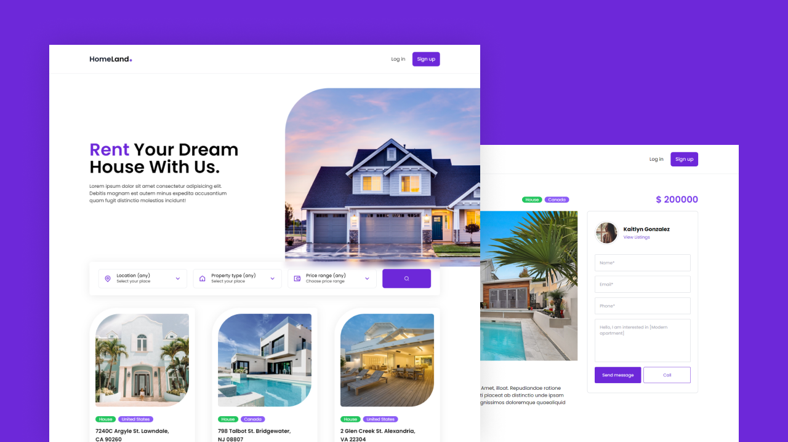

## Samson Sanyaolu
# Build A Real Estate App Using React JS & Tailwind CSS
### Responsive Real Estate App Using React JS & Tailwind CSS
<ul>
  <li>react-icons</li>
  <li>swiper</li>
</ul>

## Setup

First, copy the command below.
<br />
Then open the terminal screen, come to an area where you want the project to be installed, paste it and run it.

```
git clone https://github.com/sosarenaint/real-estate-main.git
```
<br />
After the cloning process, write the name of the project on the terminal screen, paste the code below and run it.

```
cd react-portfolio && npm install
```

## Operation

We can start our project by running the following command in the project directory.


```
npm start
```

Runs the application in development mode.\
Opens [http://localhost:3000](http://localhost:3000) to view the project in the browser.

If you edit, the page will reload.\
You can instantly see any error or log records on the console screen.

## More

For more and any questions you may have, follow my [github] (https://github.com/Sosarenaint) you can reach me on my personal [website] (https://react.sosarena.com/) and make "Pull Request" requests.


